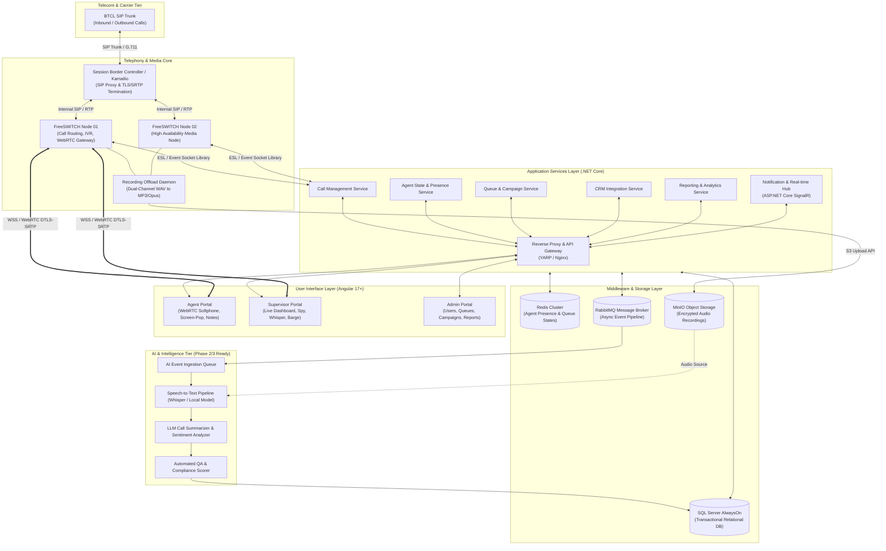
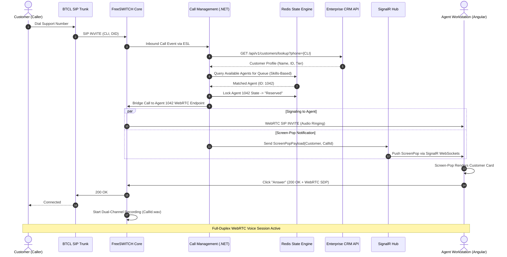
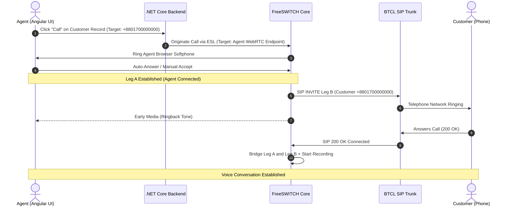
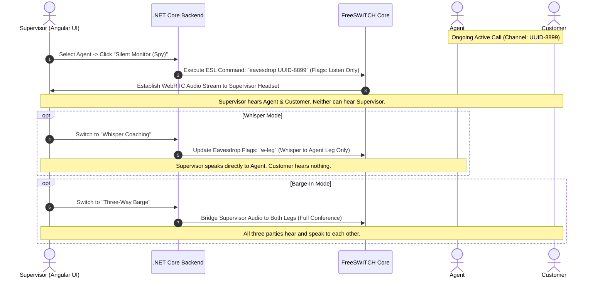
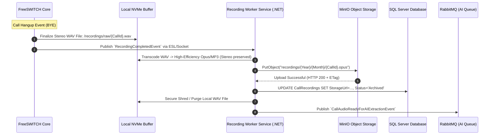
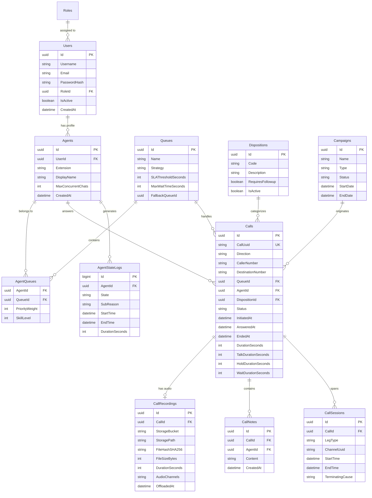
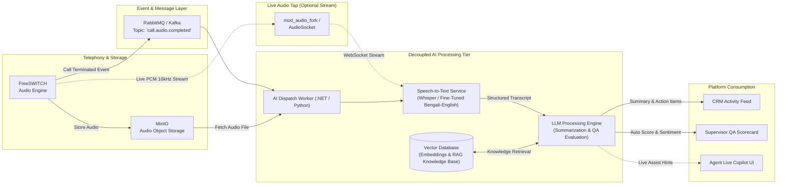
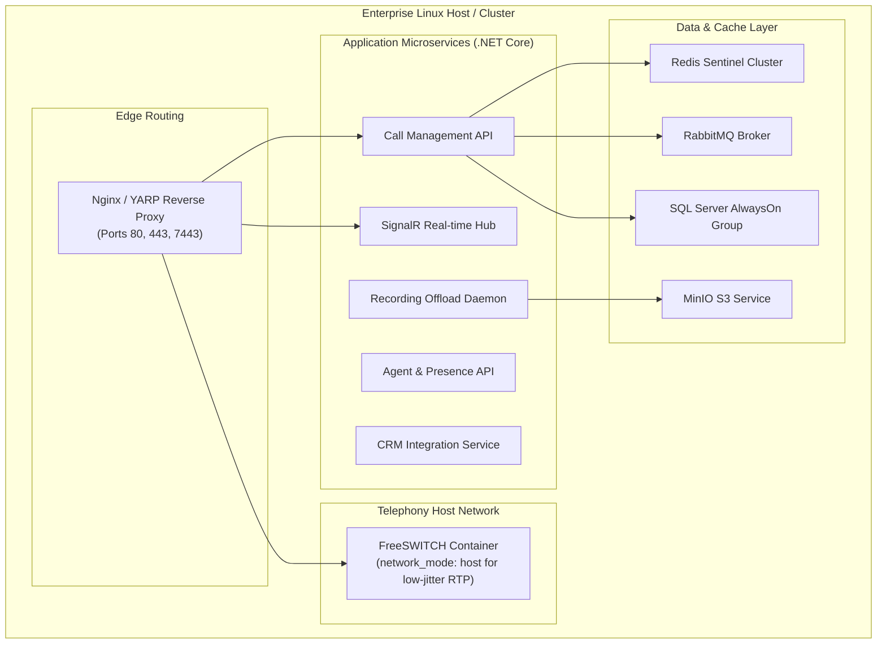

# Call Center Voice Calling Platform
## System Requirements Analysis, Technical Architecture, and Implementation Blueprint

**Document Version:** 1.0.0  
**Role:** Lead System Analyst & Principal Solution Architect  
**Target Organization:** Enterprise In-House Contact Center Operations  
**Date:** September 2026  

---

## Executive Summary

This document establishes the comprehensive technical blueprint for replacing a third-party contact center solution with a modern, highly scalable, enterprise-grade, in-house **Call Center Voice Calling Platform**. 

The platform will initially support **50+ active agents** with the architectural headroom to scale horizontally to **500+ agents**, multiple concurrent campaigns, and distributed supervisory teams without architectural redesign. The platform terminates direct public telephony through **BTCL (Bangladesh Telecommunications Company Limited)** via high-capacity SIP trunking, interfaces seamlessly with existing enterprise **CRM APIs**, runs softphones natively in the browser via **WebRTC**, and provides a modular event-driven backbone ready for modern **AI-driven voice analytics and automation**.

---

# Table of Contents
1. [Section 1: Comprehensive Requirement Analysis](#section-1-comprehensive-requirement-analysis)
   - 1.1 Business Goals & Strategic Rationale
   - 1.2 Stakeholder Matrix & Impact Analysis
   - 1.3 System Assumptions & Environmental Dependencies
   - 1.4 Detailed Functional Requirements (FR)
   - 1.5 Non-Functional Requirements (NFR)
   - 1.6 Risk Analysis & Mitigation Matrix
   - 1.7 Out-of-Scope Items for MVP
2. [Section 2: Stakeholder Clarification Question List](#section-2-stakeholder-clarification-question-list)
   - 2.1 Business & Strategic Questions
   - 2.2 Telephony & BTCL Carrier Questions
   - 2.3 Operational & Workforce Questions
   - 2.4 CRM & Integration Questions
   - 2.5 Security, Regulatory & Compliance Questions
   - 2.6 Infrastructure & Scalability Questions
3. [Section 3: MVP Feature Scope & Justification](#section-3-mvp-feature-scope--justification)
   - 3.1 MVP Inclusion Matrix
   - 3.2 MVP Exclusion Matrix
   - 3.3 Prioritization Scoring & Trade-Off Analysis
4. [Section 4: High-Level System Architecture & Design](#section-4-high-level-system-architecture--design)
   - 4.1 System Architecture Topology (Diagram & Components)
   - 4.2 Telephony Core Selection: FreeSWITCH vs. Asterisk
   - 4.3 WebRTC Audio & Media Gateway Topology
   - 4.4 Data Flow Workflows & Sequence Diagrams
     - Inbound ACD Flow with Dynamic Screen-Pop
     - Outbound Click-to-Call Flow
     - Supervisor Live Call Coaching (Whisper/Barge/Spy)
     - Audio Recording & Offload Pipeline
   - 4.5 API Communication & Protocol Strategy
5. [Section 5: Database Architecture & Data Modeling](#section-5-database-architecture--data-modeling)
   - 5.1 Entity Relationship Diagram (ERD)
   - 5.2 Relational Data Dictionary & Schema Definition (SQL Server)
   - 5.3 In-Memory Real-Time State Design (Redis)
   - 5.4 Blob/Object Storage Lifecycle (MinIO / S3-Compatible)
6. [Section 6: Scalability, High Availability & Disaster Recovery](#section-6-scalability-high-availability--disaster-recovery)
   - 6.1 Scaling Path: 50 to 500+ Agents
   - 6.2 Telephony Clustering with Kamailio SIP Proxy
   - 6.3 Application & Microservice Tier Clustering
   - 6.4 Telephony Dimensioning, Codecs & Network Sizing
   - 6.5 High Availability & Database Failover
   - 6.6 Backup & Disaster Recovery (RPO & RTO Targets)
7. [Section 7: AI Readiness Architecture](#section-7-ai-readiness-architecture)
   - 7.1 Decoupled Event-Driven AI Pipeline
   - 7.2 Real-Time Audio Tap & Streaming Hooks
   - 7.3 Post-Call Processing: Transcription, Summarization & Sentiment
   - 7.4 Agent Copilot / Assistance (RAG Knowledge Engine)
   - 7.5 Automated AI Quality Assurance (QA) Scoring
8. [Section 8: Deployment, Infrastructure & DevOps Strategy](#section-8-deployment-infrastructure--devops-strategy)
   - 8.1 Multi-Environment Topologies (Dev, Staging, Production)
   - 8.2 Containerization & Orchestration Blueprint
   - 8.3 CI/CD Automation Pipelines
   - 8.4 Zero-Downtime Deployment & Rollback Protocol
   - 8.5 Full-Stack Observability & Telephony Health Monitoring

---

# Section 1: Comprehensive Requirement Analysis

### 1.1 Business Goals & Strategic Rationale
1. **Total Cost of Ownership (TCO) Reduction:** Eliminate perpetual per-seat licensing costs, recurring third-party vendor markups, and exorbitant charges for voice recording retention and API hits.
2. **Data Sovereignty & Infrastructure Control:** Maintain 100% on-premises/private-cloud governance over customer telephone records, proprietary call recordings, customer interaction histories, and internal performance data.
3. **Deep, Native CRM Integration:** Eliminate browser pop-up blockers, multi-window friction, and out-of-sync agent states by seamlessly uniting telephony actions with customer records in real time.
4. **Reliable Local Telephony Termination:** Connect directly to BTCL (Bangladesh Telecommunications Company Limited) SIP trunks, guaranteeing low voice latency (<30ms round-trip within national boundaries) and superior audio clarity.
5. **Operational Visibility & Workforce Optimization:** Provide supervisors and call center management with unified real-time operational telemetry, live call monitoring/coaching capabilities, and granular historical performance metrics.
6. **Future-Proof Foundation:** Architect the voice engine from Day 1 to ingest conversational AI, automated summarization, real-time transcription, and dynamic sentiment evaluation.

### 1.2 Stakeholder Matrix & Impact Analysis

| Stakeholder Group | Key Interests & Business Objectives | Primary Concerns & Risks |
| :--- | :--- | :--- |
| **Executive Leadership / Sponsors** | TCO reduction, operational continuity, high ROI, platform stability, organizational scalability. | Project delays, business disruption during transition, upfront hardware/software capital expenditure. |
| **Call Center Agents (50 -> 500)** | Fast, responsive web softphone, one-click dialing, instant CRM customer screen-pop, minimal manual entry, stable audio without dropped calls. | Complex UI, system latency, audio echo, dropped customer calls, lost call notes. |
| **Supervisors & Team Leads** | Real-time agent status dashboards, queue monitoring, silent monitoring (spy), whisper coaching, call barge-in, queue reassignment. | Blind spots during call spikes, inaccurate SLA metrics, inability to intervene in difficult calls. |
| **Quality Assurance (QA) Officers** | High-fidelity stereo call recordings (separated agent/customer audio tracks), search/filter by disposition, playback controls, scorecard evaluation. | Corrupted audio recordings, missing metadata, delayed offload to storage, recording storage exhaustion. |
| **Call Center Managers / Directors** | Queue SLA tracking, workforce scheduling reports, call abandonment rates, first-call resolution (FCR), campaign outcome analytics. | Data inconsistency between telephony logs and CRM records, lack of custom drill-down reports. |
| **IT & Infrastructure Team** | Standardized container deployment, automated backups, resource utilization, server hardware sizing, high availability, simple maintenance. | Telephony jitter, network packet loss, SIP NAT traversal issues, database lock contention, failover complexity. |
| **Telephony / Network Engineers** | BTCL SIP trunk interconnection, codec negotiation, SBC (Session Border Controller) security, firewall port allocation, QoS (DiffServ/CoS). | Carrier-side trunk drops, RTP packet loss, firewall blocking UDP RTP ports, SIP INVITE floods. |
| **CRM Team & Developers** | Clean REST API contracts, idempotent webhooks, bidirectional synchronization, minimal load on existing CRM databases. | CRM API rate limiting, unhandled payload schemas, concurrency locks during peak hours. |
| **Compliance & Legal Officers** | BTRC (Bangladesh Telecommunication Regulatory Commission) compliance, data privacy, customer consent disclosure, audit log immutability. | Regulatory penalties for illicit call routing, non-compliant data retention, unauthorized recording access. |

### 1.3 System Assumptions & Environmental Dependencies
1. **Telephony Interconnection:** BTCL delivers an IP-based SIP Trunk either through a dedicated leased line (IP-VPN / Metro Ethernet) terminating at the company's datacenter or via dedicated public static IPs with SIP credentials.
2. **On-Premises Infrastructure:** The company provides hypervisors (VMware vSphere / Proxmox / Nutanix) or bare-metal Linux servers configured with enterprise-grade storage (SAN/NAS or NVMe arrays) and redundant Gigabit NICs.
3. **Agent Hardware & Browser Environment:** All agents are equipped with dual-ear USB noise-canceling headsets and run modern Chromium-based web browsers (Chrome / Edge v115+) supporting WebRTC with Opus/G.711 codecs.
4. **CRM System Readiness:** The existing CRM exposes accessible RESTful or GraphQL endpoints capable of processing at least 50 requests/second for customer lookups and activity updates, authenticated via OAuth2 or secure API keys.
5. **Local Network Infrastructure:** The internal office LAN supports Voice QoS (802.1p / DSCP tagging with Expedited Forwarding - EF 46) and adequate bandwidth allocation (minimum 100 kbps symmetric per active call).

### 1.4 Detailed Functional Requirements (FR)

#### FR-1: Telephony Core & Call Handling
- **FR-1.1:** Terminate and originate concurrent calls via BTCL SIP Trunking using standard Session Initiation Protocol (RFC 3261).
- **FR-1.2:** Negotiate audio codecs seamlessly: G.711 A-law/U-law (standard carrier) and Opus (optimized browser WebRTC delivery).
- **FR-1.3:** Complete Inbound Call Routing: DID mapping, IVR menus, dynamic skills-based queue distribution, time-of-day/holiday schedules.
- **FR-1.4:** Complete Outbound Calling: Direct manual keypad dialing and one-click CRM click-to-dial.
- **FR-1.5:** Mid-Call Controls: Hold/Resume (with customizable music on hold), Mute/Unmute, Blind Transfer, Attended (Warm) Transfer, and DTMF keypad generation.

#### FR-2: Intelligent Queue Management & ACD (Automatic Call Distribution)
- **FR-2.1:** Support routing strategies: Longest Idle Agent, Round Robin, Ring All, and Skill-Based Routing.
- **FR-2.2:** Queue Announcements: Real-time dynamic queue position and estimated wait time calculation.
- **FR-2.3:** Overflow & Fallback Handlers: Route to voicemail, secondary fallback queue, or overflow number when queue SLA or wait timeout is exceeded.
- **FR-2.4:** Priority Queuing: Elevate high-value customers (identified via incoming caller ID / CRM lookup) to the front of the queue.

#### FR-3: Agent Workspace & State Management (WebRTC Softphone)
- **FR-3.1:** Integrated browser-based WebRTC softphone eliminating external desktop softphones (e.g., Zoiper, MicroSIP).
- **FR-3.2:** Explicit Agent State Controller: `Available`, `On Call`, `Wrap-Up (After Call Work - ACW)`, `Break (Tea, Lunch, Training)`, `Offline`.
- **FR-3.3:** Auto-Wrap-up Timer: Configurable countdown timer forcing the agent back into `Available` or a `Pending Ready` state after dispositioning.
- **FR-3.4:** Automatic Call Pop (Screen-Pop): Instant bi-directional UI notification bearing customer name, account status, and call history fetched from the CRM.
- **FR-3.5:** Call Disposition & Notes: Mandatory post-call disposition tagging and note entry before the agent can receive the next call.

#### FR-4: Supervisor Control & Quality Coaching
- **FR-4.1:** Real-time visual monitoring of all agent states, current active call durations, and idle times.
- **FR-4.2:** Three-tier live call intervention:
  - **Silent Spy (Monitor):** Listen to the live conversation without agent or customer awareness.
  - **Whisper Coaching:** Speak directly into the agent's headset without the customer hearing.
  - **Barge-In (Three-Way Conference):** Join the call as an active participant to assist in resolution.
- **FR-4.3:** Forced state modification: Supervisor can remotely change an agent's state (e.g., change forgotten `Available` to `Break`).

#### FR-5: Call Recording & Storage Management
- **FR-5.1:** Automated dual-channel (stereo) call recording (Channel 0: Agent audio; Channel 1: Customer audio) for pristine AI transcription and QA fidelity.
- **FR-5.2:** Secure offload of recordings from telephony servers to centralized S3/MinIO Object Storage with immediate local purge.
- **FR-5.3:** Role-Based Access Control (RBAC) restricted playback interface with waveform visualization, audit-logged playback, and encrypted at-rest storage.

#### FR-6: CRM Integration Engine
- **FR-6.1:** Real-time incoming Caller ID (CLI) lookup against CRM customer endpoints.
- **FR-6.2:** Automatic creation of Call Detail Records (CDR) within the CRM upon call termination (including call duration, disposition, agent ID, and link to audio recording).
- **FR-6.3:** Click-to-call webhook receiver enabling CRM users to initiate calls directly from within CRM contact cards.

#### FR-7: Analytics, Historical & Real-Time Reporting
- **FR-7.1:** Real-time KPI dashboard: Current Calls Waiting, Longest Wait Time, Abandonment Rate, Agent Occupancy Rate, Service Level Agreement (% answered in <20s).
- **FR-7.2:** Historical Reports: Agent productivity (Talk Time, Hold Time, Wrap Time, Idle Time), Queue summary reports, Dispositions breakdown.
- **FR-7.3:** Export capabilities: PDF, Excel (XLSX), and automated scheduled email dispatch.

---

### 1.5 Non-Functional Requirements (NFR)

```
+-----------------------------------------------------------------------------------+
|                           NON-FUNCTIONAL REQUIREMENTS                             |
+---------------------+-------------------------------------------------------------+
| PERFORMANCE         | Voice Latency: <150ms round-trip (carrier to browser).      |
|                     | Screen-Pop Latency: <500ms from INVITE arrival to browser.  |
|                     | Concurrent Calls: 100+ active calls (200 channels) for MVP. |
+---------------------+-------------------------------------------------------------+
| AVAILABILITY        | 99.95% uptime during operational business hours.            |
|                     | Redundant clustering across core telephony & web layers.    |
+---------------------+-------------------------------------------------------------+
| SECURITY            | Signaling: SIP over TLS (Transport Layer Security).         |
|                     | Media: SRTP (Secure Real-Time Transport Protocol) / WebRTC. |
|                     | Identity: JWT, RBAC, OAuth2 CRM, encrypted recordings.      |
+---------------------+-------------------------------------------------------------+
| SCALABILITY         | Horizontal scaling: 50 -> 500+ agents without refactoring.  |
|                     | Event-driven async message bus (RabbitMQ) + Redis cache.    |
+---------------------+-------------------------------------------------------------+
| DISASTER RECOVERY   | RPO (Recovery Point Objective): < 15 minutes.               |
|                     | RTO (Recovery Time Objective): < 60 minutes for cold site.  |
+---------------------+-------------------------------------------------------------+
```

1. **Voice Performance & Latency:**
   - Mouth-to-ear latency must not exceed **150ms** (target **<40ms** across local BTCL network).
   - Jitter buffer dynamically maintained below **30ms**. Packet loss target **<0.5%**.
   - UI screen-pop must render on the agent's browser within **500ms** of the SIP INVITE arriving at the telephony core.

2. **Availability & Resilience:**
   - Platform availability target: **99.95%** during active contact center operational windows.
   - Zero single points of failure across web frontends, backend APIs, and database instances.
   - Core telephony service watchdog with automatic sub-second process restart.

3. **Security, Confidentiality & Compliance:**
   - Signaling encryption: SIP over TLS between core components; HTTPS/WSS (WebSockets Secure) to browser clients.
   - Media encryption: Mandatory SRTP (Secure RTP) with DTLS key exchange for all browser WebRTC streams.
   - Role-Based Access Control (RBAC): Strict segregation between `Agent`, `Supervisor`, `QA Reviewer`, `Campaign Manager`, and `System Admin`.
   - Recording protection: Audio files encrypted at rest (AES-256) with tamper-evident audit logs capturing every listen, download, or share event.

4. **Monitoring & Observability:**
   - Telephony metric exposure via Prometheus (active channels, SIP registration status, call error codes like 486, 503, 603).
   - Distributed application tracing and centralized structured logging using Serilog, OpenTelemetry, and Seq/ELK.
   - VoIP call quality monitoring (MOS - Mean Opinion Score tracking per call session).

5. **Maintainability & Extensibility:**
   - Backend built following Clean Architecture / Domain-Driven Design (DDD) principles in .NET Core.
   - Frontend built using modular Angular feature modules and standalone components.
   - Completely decoupled messaging topology via RabbitMQ enabling plug-and-play AI workers.

---

### 1.6 Risk Analysis & Mitigation Matrix

| Risk ID | Risk Description | Severity | Likelihood | Technical Mitigation Strategy |
| :--- | :--- | :--- | :--- | :--- |
| **RSK-01** | BTCL SIP Trunk instability or single-pipe failure. | Critical | Medium | Procure dual physical interconnects from BTCL terminating on redundant Session Border Controllers (SBCs) or failover routers with automated BGP/route failover. |
| **RSK-02** | WebRTC NAT/Firewall traversal failure in remote/branch setups. | High | High | Deploy dedicated redundant STUN/TURN servers (Coturn) on DMZ with static public IPs to handle symmetric NAT traversal. |
| **RSK-03** | Local disk exhaustion due to high-volume audio recordings. | High | High | Implement an automated background offload daemon (.NET Worker Service) that uploads completed recordings to MinIO/S3 object storage immediately upon call hangup, purging local files after checksum verification. |
| **RSK-04** | CRM API latency or temporary outage freezing agent UI. | High | Medium | Asynchronous CRM integration: Screen-pop uses cached data or non-blocking HTTP timeouts (max 1.5s); Call log syncing uses RabbitMQ queues with retry and dead-letter queues (DLQ). |
| **RSK-05** | Headset/Audio peripheral permission and driver issues in browser. | Medium | High | Implement a mandatory "Pre-Flight Device Check" modal in Angular that validates microphone permissions, audio levels, and speaker output before allowing an agent to transition to `Available`. |
| **RSK-06** | Telephony core crash or lockup under high concurrent load. | Critical | Low | Isolate telephony media processes (FreeSWITCH/Asterisk) from application logic. Run multiple worker nodes behind a Kamailio SIP load balancer with automated health checking. |

---

### 1.7 Out-of-Scope Items for MVP
To guarantee a high-quality, on-time, and stable delivery, the following capabilities are explicitly classified as **Out of Scope for the initial MVP Phase**:

1. **Omnichannel Channels:** WhatsApp, SMS, Email, Web Chat, and Social Media message management (Voice only for MVP).
2. **Predictive / Automated Mass Outbound Dialer:** Algorithmic predictive dialing with answering machine detection (AMD) (Manual click-to-call and simple preview dialing only for MVP).
3. **Real-time AI Voicebots & Autonomous IVR:** Conversational voicebots replacing human IVR menus (Standard DTMF multi-level IVR for MVP).
4. **Real-Time Live Speech-to-Text Transcription:** Streaming speech transcription during the call (Architecture is designed for it, but ingestion will occur post-MVP).
5. **Mobile Softphone Native Apps:** iOS and Android native agent apps (Browser-based desktop workstation softphones only for MVP).
6. **Billing & Telecom Rating Engine:** Multi-tenant billing and toll rating (System will capture call durations and CDRs, but monetary rating is excluded).

---

# Section 2: Stakeholder Clarification Question List

The following categorized questionnaire must be reviewed with business, operational, and technical leadership prior to code freeze:

```
+-----------------------------------------------------------------------------------+
|                        STAKEHOLDER QUESTION CLASSIFICATION                        |
+-----------------------------------------------------------------------------------+
|  [Business & Strategy]      -> Call Volumes, SLAs, Growth Milestones, ROI Target  |
|  [Telephony & BTCL Trunk]   -> Physical Hand-off, SIP Auth, Pilot Numbers, Codecs |
|  [Operations & Workforce]   -> Shift Patterns, Skill Matrix, Wrap-Up Rules, QA    |
|  [CRM & Integrations]       -> Endpoint Latency, Auth Tokens, Data Schema, Webhook|
|  [Security & Compliance]    -> BTRC Guidelines, Voice Consent, Encryption Keys    |
|  [Infra & Scalability]      -> Hypervisors, Storage Arrays, Disaster Recovery     |
+-----------------------------------------------------------------------------------+
```

### 2.1 Business & Strategic Questions
1. What is the peak concurrent call volume anticipated on Day 1 versus Month 6 and Year 1?
2. What are the key Service Level Agreements (SLAs) enforced by management (e.g., 80% of calls answered within 20 seconds; maximum abandonment rate < 3%)?
3. What are the mandatory disposition categories required across different departments (Sales, Technical Support, Billing, Escalations)?
4. Is there an official cutover deadline when the license for the current third-party platform expires?
5. What are the expected operating hours (24/7/365 vs. 8 AM – 10 PM daily), and will emergency on-call routing be required during off-hours?

### 2.2 Telephony & BTCL Carrier Questions
1. What is the exact physical and network hand-off delivery model from BTCL (e.g., dedicated dark fiber, E1 converted to SIP via media gateway, or private Metro Ethernet IP-VPN)?
2. Does BTCL provide SIP authentication via IP-whitelisting (IP Authentication) or SIP Registration (Username/Password Digest authentication)?
3. What audio codecs are supported and prioritized by the BTCL exchange (G.711 A-law, G.729, or AMR)?
4. How many DIDs (Direct Inward Dialing numbers) and pilot numbers are allocated, and do outbound calls require presenting specific CLI (Caller Line Identification) per department?
5. What is BTCL's SLA for trunk failover, and do they provide dual IP endpoints for carrier-side geographic redundancy?

### 2.3 Operational & Workforce Questions
1. What routing algorithms are preferred for each queue (e.g., Longest Idle Agent vs. Skill/Proficiency weightings)?
2. What is the maximum acceptable Wrap-Up / After-Call-Work (ACW) duration before an agent is auto-flagged or auto-transitioned?
3. How many supervisory tiers exist, and what are their precise permissions regarding call intervention (e.g., can team leads barge in, or only listen/whisper)?
4. Are agent breaks classified into specific categories (e.g., Lunch, Short Break, Training, Administrative Work) for payroll and productivity reconciliation?
5. How should the system behave when all agents in a queue are busy: maximum queue hold time, queue capacity limits, or optional customer callback request?

### 2.4 CRM & Integration Questions
1. Does the CRM support bidirectional webhooks, and what is its maximum sustained request rate limit (RPS)?
2. What unique identifier is used to correlate a customer record (e.g., Phone Number in E.164 format, National ID, Account Number)?
3. If an incoming caller's phone number matches multiple customer profiles in the CRM, how should the UI screen-pop present the disambiguation choices to the agent?
4. Is the CRM hosted on the same local network/datacenter as the call center platform, or is it an external SaaS solution requiring secure outbound proxy routing?

### 2.5 Security, Regulatory & Compliance Questions
1. Does the Bangladesh Telecommunication Regulatory Commission (BTRC) mandate specific data retention periods for audio call recordings and CDR metadata (e.g., minimum 6 months to 2 years)?
2. Are agents permitted to pause audio recording during the collection of sensitive financial, banking, or credit card information (PCI-DSS compliance)?
3. What are the policies governing supervisor access to recordings: can supervisors download raw WAV/MP3 files locally, or is streaming-only access strictly enforced?
4. Is an audible pre-call notification required stating *"This call is recorded for quality and training purposes"* on both inbound and outbound calls?

### 2.6 Infrastructure & Scalability Questions
1. What hypervisor platform (VMware, Proxmox, Hyper-V) or bare-metal environment is designated for hosting the core workloads?
2. What storage hardware is provisioned for call recordings, and is an on-premises enterprise S3 object storage platform (such as MinIO) already available?
3. What is the local datacenter disaster recovery posture: single-site with cold standby or multi-site active-passive replication?
4. Are agent workstations located exclusively inside the corporate LAN, or will remote work-from-home (WFH) agents access the platform via corporate VPN or public Internet?

---

# Section 3: MVP Feature Scope & Justification

To minimize delivery risk and achieve rapid time-to-market without compromising platform stability, the features have been rigorously triaged into **MVP (Phase 1)** and **Post-MVP (Phase 2 & Phase 3)**:

```
+------------------------------------------------------------------------------------+
|                               MVP FEATURE MATRIX                                   |
+-----------------------------------+------------------------------------------------+
| INCLUDED IN MVP (Phase 1)         | EXCLUDED FROM MVP (Future Phases)              |
+-----------------------------------+------------------------------------------------+
| - BTCL Inbound/Outbound Calling   | - Omnichannel (WhatsApp/SMS/Email)             |
| - WebRTC Browser Softphone        | - Predictive Automated Mass Dialer             |
| - Dynamic Queue & ACD Routing     | - Real-Time AI Speech Transcription            |
| - IVR Multi-Level Menu Engine     | - Conversational AI Chatbots & Voicebots       |
| - Real-Time Agent State Machine   | - Automated AI Sentiment QA Scoring            |
| - CRM Screen-Pop & Activity Sync  | - Native Mobile Softphone Apps                 |
| - Supervisor Silent Spy & Whisper | - Multi-Language Automated Translation         |
| - Dual-Channel Audio Recording    | - Advanced Workforce Management (WFM)          |
| - MinIO Recording Archival        | - Complex Gamification Engines                 |
| - Real-Time & Historical Reports  | - External Billing / Rating Engine             |
+-----------------------------------+------------------------------------------------+
```

### 3.1 Detailed Feature Justification & Trade-Off Matrix

| Feature Area | MVP Scope Decision | Business Value | Dev Effort | Risk Level | Architectural Justification |
| :--- | :---: | :---: | :---: | :---: | :--- |
| **BTCL SIP Trunking & Gateway** | **IN MVP** | High | Medium | Medium | Fundamental core requirement. Without carrier termination, voice communication cannot occur. |
| **WebRTC Softphone (Angular)** | **IN MVP** | High | Medium | Low | Eliminates 3rd party softphone software installation on 50+ agent machines. Runs natively inside browser tab. |
| **ACD Queue & Skills Engine** | **IN MVP** | High | High | Medium | Essential to ensure calls are routed to available, skilled agents without dropped calls. |
| **CRM Screen-Pop & Activity Log** | **IN MVP** | High | Medium | Low | Direct productivity multiplier. Ensures agents immediately view caller details and eliminates manual call logging. |
| **Supervisor Spy & Whisper** | **IN MVP** | Medium | Medium | Low | Critical for call quality management and new agent onboarding from Day 1. |
| **Dual-Channel Call Recording** | **IN MVP** | High | Low | Low | Mandatory for compliance, QA dispute resolution, and future AI ingestion. |
| **Predictive Auto-Dialer** | **OUT (Phase 2)** | High | Very High | High | Requires sophisticated statistical pacing algorithms and answering machine detection (AMD); causes regulatory and nuisance call risks. |
| **Omnichannel (Chat, Email, WhatsApp)** | **OUT (Phase 2)** | Medium | High | Medium | Introducing multi-channel routing distracts from voice stability during cutover. |
| **Real-Time AI Voice Transcription** | **OUT (Phase 3)** | High | High | High | Requires significant GPU infrastructure, low-latency streaming models, and fine-tuning for local accents (Bengali/English). |

---

# Section 4: High-Level System Architecture & Design

### 4.1 System Architecture Topology

The platform adopts a **Modular Monolith transitioning to Microservices architecture**, built with **.NET Core** backend services, an **Angular** front-end single-page application (SPA), an enterprise **Telephony Core (FreeSWITCH)**, and a resilient persistence/messaging tier.



---

### 4.2 Telephony Core Selection: FreeSWITCH vs. Asterisk

| Evaluation Criteria | Asterisk (v20+) | FreeSWITCH (v1.10+) | Strategic Recommendation & Justification |
| :--- | :--- | :--- | :--- |
| **Core Architecture** | Channel-based, stateful PBX heritage. Historically threaded per channel. | Core switching engine designed from ground up as a software switch / telecom exchange. | **FreeSWITCH Recommended:** Far superior concurrency model with clean separation of signaling and media switching. |
| **WebRTC Implementation** | PJSIP WebRTC support via WebSockets; requires careful configuration. | First-class native Verto and SIP over WSS support with robust DTLS-SRTP implementation. | **FreeSWITCH:** Proven enterprise stability terminating hundreds of browser WebRTC sessions simultaneously. |
| **Concurrency & Throughput** | ~200-300 concurrent calls per node before performance degradation. | **1,000+ concurrent calls** per node on modern multi-core server hardware. | **FreeSWITCH:** Directly aligns with the long-term roadmap scaling from 50 to 500+ agents. |
| **External Control API** | AMI (Asterisk Manager Interface) & ARI (REST Interface). | ESL (Event Socket Library) - Inbound & Outbound asynchronous socket protocol. | **FreeSWITCH:** High-throughput ESL enables .NET Core backend services to control calls at microsecond speeds via sockets. |
| **Audio Channel Recording** | MixMonitor application; requires manual post-process stereo splitting. | Native stereo dual-channel recording (`RECORD_STEREO=true`) out of the box. | **FreeSWITCH:** Separates agent and customer tracks directly into Left/Right channels, optimal for AI transcription. |

---

### 4.3 WebRTC Audio & Media Gateway Topology

To deliver browser-based calling without desktop client software:
1. **Signaling Channel:** Angular web clients establish a secure WebSocket (`wss://telephony.local:7443`) connection terminating on FreeSWITCH. The SIP over WebSocket protocol (RFC 7118) handles `INVITE`, `RINGING`, `ACK`, and `BYE`.
2. **Media Channel:** Upon call setup, WebRTC initiates peer-to-peer media negotiation using **SDP (Session Description Protocol)**. DTLS (Datagram Transport Layer Security) performs the mutual handshake and generates cryptographic keys for **SRTP (Secure Real-Time Transport Protocol)**.
3. **NAT Traversal (STUN/TURN):** A redundant Coturn server cluster handles ICE (Interactive Connectivity Establishment) candidate exchange, ensuring media flows uninterrupted even if agents operate across complex corporate subnets or remote branches.

---

### 4.4 Data Flow Workflows & Sequence Diagrams

#### 4.4.1 Inbound Call Routing with Dynamic Screen-Pop Flow



#### 4.4.2 Outbound Click-to-Call Flow



#### 4.4.3 Supervisor Live Coaching (Silent Spy, Whisper, Barge-In)



#### 4.4.4 Audio Recording, Offload & Lifecycle Pipeline



---

### 4.5 API Communication & Protocol Strategy

1. **Internal Service Communication:** High-throughput JSON REST APIs combined with asynchronous event pub/sub via **RabbitMQ** for cross-boundary domain notifications.
2. **Real-time Client Communication:** **ASP.NET Core SignalR** maintains persistent WebSocket connections with Agent and Supervisor browser portals. Events pushed in real time include:
   - `AgentStateChangedEvent`
   - `QueueMetricsUpdatedEvent`
   - `IncomingCallScreenPopEvent`
   - `ActiveCallTerminatedEvent`
3. **Telephony Interfacing:** Dedicated C# background services utilize **NEventSocket / FreeSWITCH ESL** to execute commands and subscribe to channel events (`CHANNEL_CREATE`, `CHANNEL_ANSWER`, `CHANNEL_HANGUP`, `RECORD_STOP`).

---

# Section 5: Database Architecture & Data Modeling

### 5.1 Entity Relationship Diagram (ERD)



---

### 5.2 Relational Data Dictionary & Schema Definition (SQL Server)

Below are the core Data Definition Language (DDL) schemas engineered with enterprise constraints, foreign keys, and performant indexes:

```sql
-- 1. Core Users and Role Table
CREATE TABLE Roles (
    RoleId UNIQUEIDENTIFIER PRIMARY KEY DEFAULT NEWSEQUENTIALID(),
    RoleName NVARCHAR(50) NOT NULL UNIQUE,
    Description NVARCHAR(255) NULL
);

CREATE TABLE Users (
    UserId UNIQUEIDENTIFIER PRIMARY KEY DEFAULT NEWSEQUENTIALID(),
    Username NVARCHAR(100) NOT NULL UNIQUE,
    Email NVARCHAR(256) NOT NULL UNIQUE,
    PasswordHash NVARCHAR(512) NOT NULL,
    RoleId UNIQUEIDENTIFIER NOT NULL FOREIGN KEY REFERENCES Roles(RoleId),
    IsActive BIT NOT NULL DEFAULT 1,
    CreatedAt DATETIMEOFFSET NOT NULL DEFAULT SYSDATETIMEOFFSET()
);

-- 2. Agent Operational Profiles
CREATE TABLE Agents (
    AgentId UNIQUEIDENTIFIER PRIMARY KEY DEFAULT NEWSEQUENTIALID(),
    UserId UNIQUEIDENTIFIER NOT NULL UNIQUE FOREIGN KEY REFERENCES Users(UserId),
    Extension NVARCHAR(20) NOT NULL UNIQUE,
    DisplayName NVARCHAR(150) NOT NULL,
    CurrentState NVARCHAR(50) NOT NULL DEFAULT 'Offline',
    StateChangedAt DATETIMEOFFSET NOT NULL DEFAULT SYSDATETIMEOFFSET(),
    CreatedAt DATETIMEOFFSET NOT NULL DEFAULT SYSDATETIMEOFFSET()
);

-- 3. Agent State Audit Log (Crucial for Productivity Analytics)
CREATE TABLE AgentStateLogs (
    LogId BIGINT IDENTITY(1,1) PRIMARY KEY,
    AgentId UNIQUEIDENTIFIER NOT NULL FOREIGN KEY REFERENCES Agents(AgentId),
    State NVARCHAR(50) NOT NULL, -- Available, OnCall, ACW, Break, Lunch, Offline
    SubReason NVARCHAR(100) NULL,
    StartTime DATETIMEOFFSET NOT NULL,
    EndTime DATETIMEOFFSET NULL,
    DurationSeconds AS DATEDIFF(SECOND, StartTime, EndTime)
);
CREATE NONCLUSTERED INDEX IX_AgentStateLogs_Agent_Time 
ON AgentStateLogs(AgentId, StartTime, EndTime);

-- 4. Queues & Skills Definition
CREATE TABLE Queues (
    QueueId UNIQUEIDENTIFIER PRIMARY KEY DEFAULT NEWSEQUENTIALID(),
    QueueName NVARCHAR(100) NOT NULL UNIQUE,
    Strategy NVARCHAR(50) NOT NULL DEFAULT 'LongestIdle', -- LongestIdle, RoundRobin, RingAll
    SLAThresholdSeconds INT NOT NULL DEFAULT 20,
    MaxWaitTimeoutSeconds INT NOT NULL DEFAULT 300,
    IsActive BIT NOT NULL DEFAULT 1
);

CREATE TABLE AgentQueues (
    AgentId UNIQUEIDENTIFIER NOT NULL FOREIGN KEY REFERENCES Agents(AgentId),
    QueueId UNIQUEIDENTIFIER NOT NULL FOREIGN KEY REFERENCES Queues(QueueId),
    SkillLevel INT NOT NULL DEFAULT 1, -- 1 to 10
    PRIMARY KEY (AgentId, QueueId)
);

-- 5. Dispositions Lookup
CREATE TABLE Dispositions (
    DispositionId UNIQUEIDENTIFIER PRIMARY KEY DEFAULT NEWSEQUENTIALID(),
    Code NVARCHAR(50) NOT NULL UNIQUE,
    Description NVARCHAR(200) NOT NULL,
    Category NVARCHAR(100) NOT NULL,
    IsActive BIT NOT NULL DEFAULT 1
);

-- 6. Central Call Detail Records (CDR)
CREATE TABLE Calls (
    CallId UNIQUEIDENTIFIER PRIMARY KEY DEFAULT NEWSEQUENTIALID(),
    CallUuid NVARCHAR(64) NOT NULL UNIQUE, -- Telephony Core UUID
    Direction NVARCHAR(20) NOT NULL,       -- Inbound, Outbound
    CallerNumber NVARCHAR(50) NOT NULL,
    DestinationNumber NVARCHAR(50) NOT NULL,
    QueueId UNIQUEIDENTIFIER NULL FOREIGN KEY REFERENCES Queues(QueueId),
    AgentId UNIQUEIDENTIFIER NULL FOREIGN KEY REFERENCES Agents(AgentId),
    DispositionId UNIQUEIDENTIFIER NULL FOREIGN KEY REFERENCES Dispositions(DispositionId),
    Status NVARCHAR(50) NOT NULL,          -- Answered, Abandoned, Busy, Failed
    InitiatedAt DATETIMEOFFSET NOT NULL,
    AnsweredAt DATETIMEOFFSET NULL,
    EndedAt DATETIMEOFFSET NOT NULL,
    TotalDurationSeconds INT NOT NULL DEFAULT 0,
    TalkDurationSeconds INT NOT NULL DEFAULT 0,
    HoldDurationSeconds INT NOT NULL DEFAULT 0,
    WaitDurationSeconds INT NOT NULL DEFAULT 0,
    CRMContactId NVARCHAR(100) NULL,
    CreatedAt DATETIMEOFFSET NOT NULL DEFAULT SYSDATETIMEOFFSET()
);
CREATE NONCLUSTERED INDEX IX_Calls_Dates_Status ON Calls(InitiatedAt, Status) INCLUDE (AgentId, QueueId);
CREATE NONCLUSTERED INDEX IX_Calls_Caller ON Calls(CallerNumber);

-- 7. Call Recordings Metadata
CREATE TABLE CallRecordings (
    RecordingId UNIQUEIDENTIFIER PRIMARY KEY DEFAULT NEWSEQUENTIALID(),
    CallId UNIQUEIDENTIFIER NOT NULL UNIQUE FOREIGN KEY REFERENCES Calls(CallId),
    StorageBucket NVARCHAR(100) NOT NULL,
    StoragePath NVARCHAR(500) NOT NULL,
    FileHashSHA256 NVARCHAR(64) NOT NULL,
    FileSizeBytes BIGINT NOT NULL,
    DurationSeconds INT NOT NULL,
    AudioChannels NVARCHAR(20) NOT NULL DEFAULT 'Stereo', -- Stereo: Left=Agent, Right=Customer
    IsArchived BIT NOT NULL DEFAULT 1,
    OffloadedAt DATETIMEOFFSET NOT NULL DEFAULT SYSDATETIMEOFFSET()
);
```

---

### 5.3 In-Memory Real-Time State Design (Redis)

Because relational databases degrade under millisecond-level polling from 500 agents and supervisors, **Redis** stores live transient states:

1. **Agent Presence Hash:**
   - Key: `agent:state:{AgentId}`
   - Type: `Hash`
   - Fields: `status` ("Available"), `since` ("2026-09-15T10:00:00Z"), `extension` ("1042"), `current_call_uuid` ("null").
2. **Queue Available Agents Sorted Set:**
   - Key: `queue:available:{QueueId}`
   - Type: `Sorted Set (ZSET)`
   - Score: Epoch timestamp of when agent transitioned to `Available` (Enables instant retrieval of the "Longest Idle" agent via `ZRANGE 0 0`).
3. **Live Active Calls Set:**
   - Key: `telephony:active_calls`
   - Type: `Set`
   - Members: Active `CallUuid` strings for instant dashboard counting without running `COUNT(*)` SQL queries.

---

### 5.4 Blob/Object Storage Lifecycle (MinIO / S3)

Call recordings are managed with a strict retention and compression lifecycle:
- **Hot Tier (Local NVMe Storage):** Recorded as uncompressed 16-bit PCM 8kHz/16kHz Stereo WAV files for immediate zero-loss post-call processing.
- **Warm Tier (MinIO Object Storage):** Compressed to high-fidelity Opus (32 kbps stereo) or MP3 (64 kbps), encrypted using server-side AES-256 (`x-amz-server-side-encryption`), and organized by date:  
  `s3://call-center-recordings/v1/{YYYY}/{MM}/{DD}/{CallUuid}.opus`
- **Cold Tier (Long-Term Archival):** Automated MinIO bucket lifecycle policy transitions recordings older than 90 days to low-cost archival storage or compressed cold partitions, retaining metadata records indefinitely in SQL Server.

---

# Section 6: Scalability, High Availability & Disaster Recovery

### 6.1 Scaling Path: 50 to 500+ Agents

```
+------------------------------------------------------------------------------------+
|                                SCALING TIMELINE                                    |
+------------------------------------------------------------------------------------+
|  CURRENT STATE: 50+ Agents        -->    FUTURE STATE: 500+ Agents                 |
|  - 1-2 FreeSWITCH Nodes                  - Clustered FreeSWITCH Nodes (4-6 units)  |
|  - Single Virtual Machine SQL Server     - Kamailio SIP Load Balancers with Anycast|
|  - Redis Single Node with Sentinel       - SQL Server AlwaysOn Availability Groups |
|  - Web/API Services in Docker Compose    - Redis 3-Node Master / Replica Cluster   |
|  - 1 Gbps Leased Line to BTCL            - Kubernetes (K8s) Cluster for Services   |
|                                          - Dual 10 Gbps Redundant BTCL Trunks      |
+------------------------------------------------------------------------------------+
```

### 6.2 Telephony Clustering with Kamailio SIP Proxy
When scaling beyond 100 concurrent calls, multiple FreeSWITCH media servers are deployed behind a **Kamailio SIP Proxy/Load Balancer** layer:
- **Stateless SIP Routing:** Kamailio handles all external SIP transactions with BTCL, distributing incoming calls across the FreeSWITCH pool using dispatcher algorithms (round-robin, least-loaded, or call-load hashing).
- **Health-Check Heartbeats:** Kamailio continuously probes FreeSWITCH media nodes via SIP `OPTIONS` pings. If a FreeSWITCH node fails, it is dynamically evicted within 500ms without dropping calls on other nodes.

### 6.3 Application & Microservice Tier Clustering
- Backend .NET Core microservices are packaged as lightweight Linux containers and deployed behind **Nginx / YARP (Yet Another Reverse Proxy)**.
- Services are **100% stateless**; all session contexts, user tokens, and agent locks reside in the shared Redis Cluster.
- Horizontal Pod Autoscalers (HPA) or container replicas scale backend instances dynamically during call volume surges.

### 6.4 Telephony Dimensioning, Codecs & Network Sizing

Voice bandwidth requirements for concurrent calling channels:

$$\text{Bandwidth per Call (G.711)} = 64\text{ kbps (Payload)} + 16\text{ kbps (L2-L4 Headers)} = 80\text{ kbps}$$
$$\text{Bandwidth per Call (Opus WebRTC)} \approx 32\text{ kbps (Payload)} + 12\text{ kbps (Headers)} = 44\text{ kbps}$$

**Dimensioning Table for Planning Sizing:**

| Metric | 50 Active Agents (MVP) | 250 Active Agents | 500 Active Agents |
| :--- | :--- | :--- | :--- |
| **Peak Concurrent Voice Calls** | 50-70 calls | 250-300 calls | 500-600 calls |
| **Active RTP Channels** | 140 channels | 600 channels | 1,200 channels |
| **Network Bandwidth (G.711)** | ~5.6 Mbps symmetric | ~24.0 Mbps symmetric | ~48.0 Mbps symmetric |
| **Network Bandwidth (Opus)** | ~3.1 Mbps symmetric | ~13.2 Mbps symmetric | ~26.4 Mbps symmetric |
| **Daily Audio Storage (8 hrs @ Opus)** | ~5.7 GB / day | ~24.8 GB / day | ~49.6 GB / day |
| **Annual Recording Storage (250 days)** | **~1.4 TB / year** | **~6.2 TB / year** | **~12.4 TB / year** |

*Storage calculation based on dual-channel 32 kbps stereo Opus encoding with 8-hour shift agent utilization.*

### 6.5 High Availability & Database Failover
1. **Database Layer:** Deploy **Microsoft SQL Server AlwaysOn Availability Groups** with synchronous data commit across a primary read-write node and a secondary automatic-failover replica. Read-only reporting queries are offloaded to the secondary replica.
2. **Caching Layer:** Redis Sentinel with 3 quorum nodes providing sub-second master failover.
3. **Message Queue Layer:** 3-node RabbitMQ Quorum Queues ensuring zero message loss in the event of hardware failure.

### 6.6 Backup & Disaster Recovery Targets
- **Recovery Point Objective (RPO):**  
  - Database: **< 15 minutes** (Continuous transaction log backups every 15 minutes).  
  - Audio Files: **< 1 hour** (Real-time object storage sync with hourly off-site bucket replication).
- **Recovery Time Objective (RTO):**  
  - Application & Web Tier: **< 5 minutes** (Automated container recovery).  
  - Complete Site Disaster Recovery: **< 60 minutes** (Cold standby restoration from immutable backups).

---

# Section 7: AI Readiness Architecture

The platform is designed to incorporate AI capabilities seamlessly without disrupting core call handling. The architecture decouples the telephony engine from downstream AI workers via an asynchronous event bus:



### 7.1 Real-Time Audio Tap & Streaming Hooks
- FreeSWITCH provides native media tap modules (`mod_audio_fork` or `AudioSocket`). 
- When an AI-monitored call begins, an external media stream forks the raw 16kHz linear PCM audio over WebSockets to an AI speech ingestion service.
- This decoupling ensures that any downstream AI latency or model crashes have **zero impact on customer-agent conversation audio**.

### 7.2 Post-Call Processing: Transcription, Summarization & Sentiment
1. **Automated Trigger:** When a call terminates, the `.NET Core Recording Daemon` uploads the audio file to MinIO and publishes a `CallAudioReadyEvent(CallId, StoragePath)` to RabbitMQ.
2. **Transcription Worker:** An isolated AI worker pool dequeues the event, retrieves the stereo audio file, and processes Channel 0 (Agent) and Channel 1 (Customer) independently through an ASR model (such as OpenAI Whisper or a fine-tuned local Bengali-English dual-dialect model).
3. **Structured JSON Generation:**
   ```json
   {
     "call_id": "9f24c042-8821-4f4b-88a4-0c5db199042a",
     "duration_seconds": 248,
     "sentiment_score": 0.78,
     "customer_sentiment": "Positive",
     "executive_summary": "Customer inquired regarding bill discrepancy. Agent identified unauthorized add-on package, removed it, and credited 250 BDT. Customer expressed satisfaction.",
     "key_action_items": [
       "Billing team to verify reversal credit in next invoice cycle."
     ],
     "compliance_checklist": {
       "greeting_used": true,
       "identity_verified": true,
       "proper_closing_used": true
     }
   }
   ```
4. **CRM Sync:** The summary and sentiment are automatically posted to the CRM customer timeline via REST API.

### 7.3 Real-Time AI Agent Assistance (RAG Copilot)
- The architecture is prepared for **Retrieval-Augmented Generation (RAG)**.
- As the customer speaks, interim transcripts are matched against an internal Vector Database (e.g., Qdrant, Milvus, or pgvector) storing enterprise SOPs, product guides, and troubleshooting manuals.
- Suggested answers and relevant policy links are delivered to the agent's Angular screen via SignalR without manual search.

### 7.4 Automated AI Quality Assurance (QA) Scoring
- Eliminates manual sampling where QA officers can only listen to 2-3% of calls.
- The AI QA engine reviews **100% of recorded calls**, scoring them on:
  - Regulatory disclosure compliance.
  - Script adherence.
  - Customer profanity or escalated dissatisfaction detection.
  - Talk-to-listen ratio and dead-air duration.

---

# Section 8: Deployment, Infrastructure & DevOps Strategy

### 8.1 Multi-Environment Topologies

| Environment | Purpose | Infrastructure Specifications | Deployment Trigger |
| :--- | :--- | :--- | :--- |
| **Development (Dev)** | Feature development, unit testing, local API integration. | Containerized Docker environment on shared development VMs; Simulated SIP trunk via SIPp or local test PBX. | Continuous on merge to `develop` branch. |
| **Staging (UAT)** | QA testing, end-to-end integration, performance benchmarking, supervisor training. | Identical architectural topology to Production with smaller footprint; Connected to a dedicated BTCL test DID. | Automated on tag creation from `release/*` branch. |
| **Production (Prod)** | Live commercial operations (50 -> 500 agents). | Clustered bare-metal/VM instances with hardware redundancy, dedicated BTCL leased line SIP trunks, HA SQL AlwaysOn. | Manual approval gate with Blue/Green deployment rollout. |

---

### 8.2 Containerization & Orchestration Blueprint

The platform leverages standardized containerization across application and database tiers:



> **Critical Telephony Networking Rule:**  
> FreeSWITCH containers must be deployed with `network_mode: host` to bypass Docker bridge NAT translation. This guarantees minimum jitter, eliminates audio latency overhead, and prevents RTP port exhaustion across hundreds of active media streams.

---

### 8.3 CI/CD Automation Pipelines
1. **Source Control Branching:** GitHub / GitLab Flow with protected `main` and `release` branches.
2. **Continuous Integration (CI):**
   - Step 1: Angular linting, Ahead-of-Time (AOT) compilation, and Karma unit tests.
   - Step 2: .NET Core Clean Architecture solution compilation, SonarQube static code security analysis, and xUnit integration tests.
   - Step 3: Docker container image build with multi-stage minimal scratch images (Alpine/Chiseled Ubuntu).
   - Step 4: Vulnerability scanning (Trivy) and push to internal secure container registry.
3. **Continuous Deployment (CD):**
   - Automated deployment to Staging via Ansible / Helm.
   - Production deployment executed using **Blue-Green** deployment for zero-downtime service upgrades.

---

### 8.4 Zero-Downtime Deployment & Rollback Protocol
- **Web & API Services:** Deployed in redundant pairs behind the reverse proxy. Traffic is dynamically shifted off the old version only after new container health probes return `HTTP 200 Healthy`.
- **Telephony Services:** FreeSWITCH upgrades use graceful channel draining:
  1. The target FreeSWITCH node is set to `DRAINING` in the Kamailio SIP proxy (no new incoming calls routed to it).
  2. Ongoing calls continue undisturbed until naturally hung up.
  3. Once active channels drop to zero, the telephony container is updated and returned to the load balancer pool.
- **Database Migrations:** All database migrations are backward-compatible using the **Expand/Contract** design pattern (Add new nullable columns first, deploy application code, then deprecate old structures).
- **Rollback Execution:** If post-deployment synthetic monitoring detects API error rates > 0.5% or dropped calls, the reverse proxy instantly flips traffic back to the standby Blue containers in under 10 seconds.

---

### 8.5 Full-Stack Observability & Telephony Health Monitoring

```
+------------------------------------------------------------------------------------+
|                         OBSERVABILITY & MONITORING STACK                           |
+------------------------------------------------------------------------------------+
|  TELEMETRY TYPE          | TOOLING & IMPLEMENTATION                                |
+--------------------------+---------------------------------------------------------+
|  Metrics Collection      | Prometheus scraping .NET endpoints & FreeSWITCH ESL     |
|  Dashboards & Alerting   | Grafana: Concurrent Calls, Abandonment Rate, MOS Score  |
|  SIP Signaling Tracing   | Homer / SIP3 (Captures entire SIP ladder diagrams)      |
|  Application Logging     | Serilog -> OpenTelemetry Collector -> Elasticsearch/Seq |
|  Audio Quality (VoIP)    | Real-time RTCP packet loss, jitter & R-factor tracking  |
+--------------------------+---------------------------------------------------------+
```

1. **Voice Quality Monitoring (MOS Score):** The system continuously calculates the Mean Opinion Score (MOS) from RTCP packets. If jitter exceeds 30ms or packet loss exceeds 1% on any call, automated alerts notify network engineers.
2. **SIP Packet Inspection (Homer/SIP3):** Every SIP packet (`INVITE`, `TRYING`, `RINGING`, `BYE`, `CANCEL`) is mirrored to a Homer encapsulation node. This provides engineers with instant end-to-end SIP call flow ladder diagrams to diagnose carrier drops within seconds.
3. **Automated Escalations:** PagerDuty / Telegram / Email integration triggers high-priority alerts if:
   - BTCL SIP trunk registration fails.
   - Unhandled API exceptions exceed 10 in a 60-second window.
   - Local recording storage buffer reaches 80% disk capacity.

---

## Conclusion & Architectural Sign-Off

This document presents a battle-tested, modular, and resilient blueprint for the enterprise **Call Center Voice Calling Platform**. By leveraging **FreeSWITCH** for industrial-grade media switching, **.NET Core** for scalable microservices, **Angular** for high-performance WebRTC softphones, and **MinIO/RabbitMQ** for decoupled storage and future AI pipelines, the platform fulfills all Day 1 MVP requirements while guaranteeing seamless horizontal expansion to 500+ agents and advanced AI automation.
