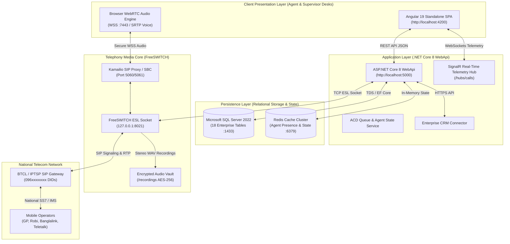

# BTCL VoiceEngine: Enterprise Call Center Voice Calling Platform

[](https://github.com/anwarhossen-dev/Call-Center-Voice-Calling-Platform)
[](https://dotnet.microsoft.com/)
[](https://angular.dev/)
[](https://www.microsoft.com/sql-server)
[](https://freeswitch.org/)
[](http://www.btrc.gov.bd/)

**BTCL VoiceEngine** is a carrier-grade, on-premises Contact Center and Voice Operations Platform engineered for enterprises transitioning from expensive third-party per-seat SaaS vendors to self-hosted telephony autonomy. It integrates directly with national telecom trunks from **Bangladesh Telecommunications Company Limited (BTCL)** and licensed IPTSPs (096 series DIDs), backed by high-throughput ASP.NET Core 8 WebApi services, an Angular 19 reactive user interface, and low-latency WebRTC media streams.

---

## Table of Contents
1. [Platform Overview & Key Objectives](#platform-overview--key-objectives)
2. [High-Level System Architecture](#high-level-system-architecture)
3. [Complete IP Address & Port Mapping Matrix](#complete-ip-address--port-mapping-matrix)
4. [Enterprise Core Modules & Features](#enterprise-core-modules--features)
5. [Role-Based Access Control (RBAC) Matrix](#role-based-access-control-rbac-matrix)
6. [System Requirements & Prerequisites](#system-requirements--prerequisites)
7. [Step-by-Step Installation & Local Setup](#step-by-step-installation--local-setup)
8. [Real-Time Calling Implementation Guide](#real-time-calling-implementation-guide)
9. [BTRC Regulatory Compliance Policies](#btrc-regulatory-compliance-policies)
10. [Database Architecture (18 Enterprise Tables)](#database-architecture-18-enterprise-tables)
11. [Production Deployment & CI/CD Strategy](#production-deployment--cicd-strategy)
12. [Troubleshooting & Common FAQs](#troubleshooting--common-faqs)
13. [Directory & Project Structure](#directory--project-structure)

---

## Platform Overview & Key Objectives

- **Telephony Autonomy:** Eliminates recurring SaaS seat costs by hosting voice switching, queue distribution, and recording storage entirely on-premises.
- **Carrier Interoperability:** Native connectivity to BTCL E1/SIP and IPTSP trunks via dedicated Session Border Controllers (SBC) and FreeSWITCH core.
- **High-Density Scaling:** Designed to launch with 50+ concurrent agents and scale frictionlessly to 500+ agents across multiple campaigns and shifts.
- **Unified CRM Screen-Pop:** Sub-100ms customer profile retrieval from existing enterprise CRM systems via non-blocking REST APIs.
- **Supervisor Call Coaching:** Real-time call intervention features including **Silent Spy**, **Whisper Coaching**, and **Barge-In**.
- **Regulatory Governance:** 100% compliant with Bangladesh Telecommunication Regulatory Commission (BTRC) mandates including authorized CLI (096 series), 2-year CDR retention, and mandatory recording consent notices.

---

## High-Level System Architecture



---

## Complete IP Address & Port Mapping Matrix

Every service in the platform communicates across well-defined interfaces and ports:

### Local Development Configuration
| Service / Component | Host / IP Address | Port | Protocol | Connected With | Description |
| :--- | :--- | :--- | :--- | :--- | :--- |
| **Frontend Web App** | `127.0.0.1` / `localhost` | **4200** | HTTP / WS | Web Browser | Angular 19 SPA client, Agent Workspace, Supervisor, Tables Explorer |
| **Backend WebApi** | `127.0.0.1` / `localhost` | **5000** | HTTP | Frontend (`:4200`) | Core REST endpoints for Auth, Calls, Campaigns, Tables, CRM |
| **Backend WebApi (TLS)** | `127.0.0.1` / `localhost` | **5001** | HTTPS | Frontend (`:4200`) | Secure encrypted API communication |
| **SignalR Telephony Hub**| `127.0.0.1` / `localhost` | **5000** | WebSockets | Frontend (`:4200`) | Push channel for screen-pops, presence updates, and queue counts |
| **Swagger API Explorer** | `127.0.0.1` / `localhost` | **5000** | HTTP | Developer Tools | Interactive API schema documentation (`/swagger`) |
| **MS SQL Server** | `(localdb)\MSSQLLocalDB` | **1433** / Pipe | TDS | Backend WebApi | Relational storage for all 18 enterprise tables and audit logs |
| **FreeSWITCH ESL Socket**| `127.0.0.1` | **8021** | TCP Socket | Backend WebApi | Event Socket Layer (Password: `ClueCon`) for call bridging & control |
| **FreeSWITCH WebRTC SIP**| `127.0.0.1` / `0.0.0.0` | **7443** (or **5066**)| WSS (Secure WS) | Agent Browser | Bi-directional agent microphone and speaker RTP voice stream |
| **FreeSWITCH SIP Trunk** | `0.0.0.0` | **5060** / **5061** | SIP (UDP/TCP) | BTCL / IPTSP SBC | SIP signaling to carrier network and inbound/outbound DIDs |
| **FreeSWITCH RTP Voice** | `0.0.0.0` | **16384 – 32768** | UDP (RTP/SRTP) | Telecom Carrier | Real-time audio packet transport (G.711u/a, Opus) |
| **Twilio Cloud Carrier** | `api.twilio.com` | **443** | HTTPS REST | Backend WebApi | Optional instant cloud PSTN calling without on-premises lines |

### Production Multi-Server IP Allocation
| Server Node | Recommended Static IP | Open Ports | Firewall Policy |
| :--- | :--- | :--- | :--- |
| **Web & Application Server** | `192.168.10.20` | 80, 443, 5000 | Reverse Proxy (Nginx) open to LAN/VPN. Encrypted HTTPS. |
| **Database Server (MS SQL)** | `192.168.10.30` | 1433 | Internal LAN only. Accessible exclusively by `192.168.10.20`. |
| **Telephony Server (FreeSWITCH)**| `192.168.10.40` | 8021 (Internal), 7443 (WSS), 5060 (SIP), 16384-32768 (RTP) | ESL open to App server only. SIP open only to BTCL gateway IP. |
| **Telecom Provider SBC** | `103.xxx.xxx.xxx` (or MPLS) | 5060, 10000-20000 | Dedicated BTCL carrier interconnect line. |

---

## Enterprise Core Modules & Features

### 1. Agent Softphone Workspace (`/agent`)
- **Embedded WebRTC Terminal:** Answer, hold, resume, transfer, and end calls directly inside the browser with zero plugins.
- **DTMF Keypad & Speed Dial:** Fast numeric input with audio feedback and single-click speed dial buttons.
- **CRM Screen-Pop:** Automatically pulls customer details, VIP tier, account balance, and recent tickets on incoming call arrival.
- **Agent Note-Taking & Snippets:** Add call notes during active conversations with single-click pre-defined operational snippets.
- **Mandatory Call Disposition:** Requires agents to log an outcome code (*Query Resolved, Follow-up Required, Escalated*) before returning to the ready state.

### 2. Supervisor Real-Time Operations Portal (`/supervisor`)
- **Real-Time Queue Telemetry:** Live counters for waiting callers, longest wait time, and queue health.
- **Agent Presence Grid:** Color-coded status view (*Available, On Call, Break, Wrap-Up, Offline*) with live duration timers.
- **Call Intervention (Coaching):**
  - **Silent Spy (`uuid_spy`):** Monitor audio silently without caller or agent awareness.
  - **Whisper Coaching (`uuid_whisper`):** Speak exclusively to the agent for real-time guidance.
  - **Barge-In (`uuid_barge`):** Intervene as a 3-way conference call for escalations.

### 3. Call Recordings & Quality Assurance (`/recordings`)
- **Dual-Channel Stereo Audio:** Records agent on Left channel and customer on Right channel for clean voice separation.
- **Interactive Audio Player:** Scrubbing bar, live waveform visualization, playback speed controls (0.5x – 2x), and channel toggles.
- **QA Scorecard Audits:** Evaluate calls against weighted scoring rubrics (Greeting, Compliance, Product Knowledge, Closing).

### 4. Call Detail Records & History (`/history`)
- Historical call log tracking with search, status filters (*Completed, Cancelled, Inbound, Outbound*), duration formatting, and CSV export.
- Role-personalized view: Agents see their own handled calls; Supervisors and Admins see organization-wide metrics.

### 5. 18-Table Enterprise Database Explorer (`/tables`)
- Comprehensive administrative schema viewer allowing live data exploration, search, pagination, and CSV export across all 18 tables.
- Built-in Record Inspector modal displaying raw JSON and key-value properties.

---

## Role-Based Access Control (RBAC) Matrix

Access to portals, navigation tabs, and API endpoints is strictly enforced through client-side route guards (`role.guard.ts`) and backend HTTP authorization guards:

| Portal / Module | Route | Admin | Supervisor | Agent |
| :--- | :--- | :---: | :---: | :---: |
| **Agent Workspace** | `/agent` | :white_check_mark: Allowed | :white_check_mark: Allowed | :white_check_mark: Allowed |
| **Call History & Logs** | `/history` | :white_check_mark: All Records | :white_check_mark: Team Records | :white_check_mark: Own Extension |
| **Supervisor Dashboard** | `/supervisor` | :white_check_mark: Allowed | :white_check_mark: Allowed | :x: **Blocked (Redirect)** |
| **Call Recordings & QA** | `/recordings` | :white_check_mark: Allowed | :white_check_mark: Allowed | :x: **Blocked (Redirect)** |
| **Admin & Campaigns** | `/admin` | :white_check_mark: Allowed | :x: **Blocked (Redirect)** | :x: **Blocked (Redirect)** |
| **Database Tables Explorer** | `/tables` | :white_check_mark: Allowed | :x: **Blocked (Redirect)** | :x: **Blocked (Redirect)** |

> **Security Rule:** Any attempt by an Agent or Supervisor to manually enter `/admin` or `/tables` into the browser URL bar will be automatically intercepted by `roleGuard` and redirected to their permitted dashboard.

---

## System Requirements & Prerequisites

### Hardware Recommendations (Per Server Node)
| Node Role | Minimum Specs (50 Agents) | Recommended Specs (500 Agents) |
| :--- | :--- | :--- |
| **Application Server** | 4 vCPU, 8 GB RAM, 50 GB SSD | 8 vCPU, 16 GB RAM, 100 GB NVMe |
| **Database Server** | 4 vCPU, 16 GB RAM, 100 GB SSD | 16 vCPU, 64 GB RAM, 500 GB NVMe RAID-10 |
| **Telephony Server** | 4 vCPU, 8 GB RAM, 200 GB Storage | 8 vCPU, 16 GB RAM, 2 TB Storage (Recordings) |
| **Agent Workstation**| Dual-Core CPU, 4 GB RAM, USB Headset | Quad-Core CPU, 8 GB RAM, Noise-Canceling USB Headset |

### Software Prerequisites
- **Operating System:** Windows 10/11 / Windows Server 2022 or Linux (Ubuntu 22.04 LTS / Debian 12)
- **.NET SDK:** Version 8.0 or newer ([Download](https://dotnet.microsoft.com/download/dotnet/8.0))
- **Node.js:** Version 18.x or 20.x LTS ([Download](https://nodejs.org/))
- **Database:** Microsoft SQL Server 2019/2022 or SQL Server Express / LocalDB
- **Browser:** Google Chrome (v115+), Microsoft Edge (v115+), or Mozilla Firefox with WebRTC enabled

---

## Step-by-Step Installation & Local Setup

### 1. Clone Repository
```powershell
git clone https://github.com/anwarhossen-dev/Call-Center-Voice-Calling-Platform.git
cd "Call Center Voice Calling Platform"
```

### 2. Configure Backend & Database
1. Navigate to the WebApi directory:
   ```powershell
   cd "backend/src/Presentation/CallCenter.WebApi"
   ```
2. Verify `appsettings.json` connection string:
   ```json
   "ConnectionStrings": {
     "DefaultConnection": "Server=(localdb)\\mssqllocaldb;Database=CallCenterDb;Trusted_Connection=True;MultipleActiveResultSets=true;TrustServerCertificate=True"
   }
   ```
3. Run the backend WebApi (it automatically applies database migrations and seeds initial roles, users, and tables):
   ```powershell
   dotnet run
   ```
   - **REST API:** `http://localhost:5000`
   - **Swagger API Docs:** `http://localhost:5000/swagger`

### 3. Configure Frontend Application
1. Open a second terminal window and navigate to the Angular directory:
   ```powershell
   cd "frontend/call-center-app"
   ```
2. Install npm dependencies:
   ```powershell
   npm install
   ```
3. Launch the development server:
   ```powershell
   npm start
   ```
   - **Web Application URL:** `http://localhost:4200`

### 4. Build Commands
To compile production distribution packages:
```powershell
# Build Angular Frontend
npm run build

# Build .NET Solution
dotnet build "backend/CallCenter.sln"
```

---

### Pre-Configured Test Credentials
| Role | Username | Password | Permitted Portals |
| :--- | :--- | :--- | :--- |
| **Admin** | `admin` | `Admin@123456` | All 6 modules (Admin, Campaigns, Tables, Supervisor, Recordings, Agent) |
| **Supervisor** | `supervisor` | `Admin@123456` | Supervisor Dashboard, Call Recordings, Call History, Agent Workspace |
| **Agent (Rahim)** | `rahim.ahmed` | `Agent@123456` | Agent Workspace, Call History |
| **Agent (Fatima)** | `fatima.khan` | `Agent@123456` | Agent Workspace, Call History |

---

## Real-Time Calling Implementation Guide

The platform includes a dual-mode telephony architecture:
1. **Interactive Simulation Mode (Default):** Runs immediately out-of-the-box without physical telecom lines for software testing, ringback tones, call state transitions, and audio capture.
2. **Live Carrier Mode:** Dispatches live voice calls to real mobile phone networks (Grameenphone, Robi, Banglalink, Teletalk, PSTN).

### Option A: Connecting to BTCL / IPTSP SIP Trunk (Production)
1. **Procure Telecom Services:** Obtain a SIP Trunk with allocated `096xxxxxxxx` DIDs from BTCL or an authorized IPTSP.
2. **Configure FreeSWITCH Sofia Trunk:**
   Create `/etc/freeswitch/sip_profiles/external/btcl_gateway.xml`:
   ```xml
   <include>
     <gateway name="btcl_trunk">
       <param name="realm" value="103.xxx.xxx.xxx"/>
       <param name="username" value="096xxxxxxxx"/>
       <param name="password" value="TrunkSecretPassword"/>
       <param name="register" value="true"/>
       <param name="caller-id-in-from" value="true"/>
     </gateway>
   </include>
   ```
3. **Configure Dialplan Routing:**
   In `/etc/freeswitch/dialplan/default.xml`, define the outbound route:
   ```xml
   <extension name="Outbound_To_Mobile">
     <condition field="destination_number" expression="^(01[3-9]\d{8})$">
       <action application="set" data="effective_caller_id_number=096xxxxxxxx"/>
       <action application="bridge" data="sofia/gateway/btcl_trunk/+880$1"/>
     </condition>
   </extension>
   ```
4. **Update `appsettings.json`:**
   ```json
   "FreeSwitch": {
     "Host": "127.0.0.1",
     "Port": 8021,
     "Password": "ClueCon",
     "SipDomain": "telephony.local",
     "BtclGatewayName": "btcl_trunk"
   }
   ```

### Option B: Instant Cloud Carrier Setup (Twilio)
To place test calls to real mobile phones immediately without physical lines:
1. Obtain an account from [Twilio.com](https://www.twilio.com).
2. Configure credentials in the platform's Admin panel or POST to `http://localhost:5000/api/calls/twilio/config`:
   ```json
   {
     "accountSid": "ACXXXXXXXXXXXXXXXXXXXXXXXXXXXXXXXX",
     "authToken": "your_auth_token",
     "fromPhoneNumber": "+12025550199",
     "enabled": true
   }
   ```
3. Dial any destination mobile number from the Agent softphone to ring live phones over PSTN.

---

## BTRC Regulatory Compliance Policies

Under the mandates of the **Bangladesh Telecommunication Regulatory Commission (BTRC)**, all contact center platforms operated in Bangladesh must comply with the following policies:

1. **Strict CLI Verification (No CLI Spoofing):**
   Outbound calls must display a genuine BTRC-allocated `096` series number or BTCL DID. Random, masked, or foreign numbers are strictly prohibited.
2. **Calling Window & Do-Not-Disturb (DND):**
   Automated telemarketing or promotional outbound calling outside **09:00 AM to 08:00 PM BST** is strictly forbidden.
3. **Mandatory Recording Consent Notice:**
   Inbound IVRs must announce that calls may be recorded for training and quality purposes prior to bridging with an agent.
4. **2-Year CDR & Audio Retention:**
   Complete Call Detail Records (CDRs) containing timestamps, durations, endpoints, gateway IPs, and audio recordings must be preserved for at least **730 days (2 years)** for regulatory audits.
5. **No Illegal VoIP Routing:**
   International voice traffic must never bypass authorized International Gateways (IGW) and Interconnection Exchanges (ICX).

---

## Database Architecture (18 Enterprise Tables)

The database schema is organized into 4 distinct functional domains in Microsoft SQL Server:

```
[Users & Governance]       [Agent Hierarchy]          [Telephony & Routing]      [CRM & Quality]
  ├── Users                  ├── Agents                 ├── Calls                  ├── Customers
  ├── Roles                  ├── AgentSkillMappings     ├── CallEvents             ├── CustomerCRMMappings
  ├── UserRoles              ├── Teams                  ├── CallQueues             ├── QAScorecards
  └── AuditLogs              ├── AgentTeamMappings      ├── CallRecordings         └── QAReviews
                             └── AgentStateLogs         ├── Dispositions
                                                        └── Campaigns
```

1. **`Users`**: System authentication credentials, email addresses, and active states.
2. **`Roles`**: Security roles (`Admin`, `Supervisor`, `Agent`).
3. **`UserRoles`**: Many-to-many security role mappings.
4. **`AuditLogs`**: Non-repudiation audit trail with user IDs, action names, timestamps, and IP addresses.
5. **`Agents`**: Contact center profiles, PBX SIP extensions, and live presence states.
6. **`AgentSkillMappings`**: Agent skills and proficiency scores for skill-based routing.
7. **`Teams`**: Departmental units (Technical Support, Sales, Billing).
8. **`AgentTeamMappings`**: Team rosters and supervisor bindings.
9. **`AgentStateLogs`**: Detailed chronological log of agent state transitions for payroll adherence.
10. **`Calls`**: Primary Call Detail Record (CDR) storing timings, duration, direction, and completion status.
11. **`CallEvents`**: Granular call state event logs (Ringing, Answered, Held, Transferred, Hangup).
12. **`CallQueues`**: ACD queue profiles, timeout thresholds, and priority algorithms.
13. **`CallRecordings`**: Audio metadata, storage paths, file sizes, and encryption keys.
14. **`Dispositions`**: Business outcome tags (*Resolved, Follow-up Required, Escalated, Wrong Number*).
15. **`Campaigns`**: Outbound dialing campaigns and lead lists.
16. **`Customers`**: Master customer directory with VIP tier classifications and contact numbers.
17. **`CustomerCRMMappings`**: External CRM ID cross-references (Salesforce, Zoho, HubSpot, Custom).
18. **`QAScorecards`**: Quality assurance scorecard templates with weighted scoring criteria.
19. **`QAReviews`**: Completed supervisor evaluation audits, scores, and coaching feedback.

---

## Production Deployment & CI/CD Strategy

### Multi-Environment Architecture
- **Development:** Local developer environment with in-memory/LocalDB database and WebAudio simulation.
- **Staging:** Internal LAN testing VM with local FreeSWITCH PBX, mock BTCL trunk, and full WebRTC testing.
- **Production:** High-availability server cluster with physical BTCL SIP Trunk, SQL Server AlwaysOn availability group, and Nginx SSL offloading.

### Zero-Downtime Deployment (Blue-Green)
- Deployments use containerized **Blue-Green** switching.
- New releases are deployed to the standby *Green* container. Following automated health check validation, Nginx switches upstream routing to *Green* with zero downtime.
- In the event of an error, traffic is reverted back to *Blue* instantly, ensuring ongoing calls remain uninterrupted.

### Backup Schedule
- **SQL Server Database:**
  - Full Backup: Nightly at 01:00 AM BST (30-day retention).
  - Differential Backup: Every 6 hours.
  - Transaction Log Backup: Every 15 minutes (Provides point-in-time recovery).
- **Audio Recordings:** Synchronized hourly to offsite secondary NAS/MinIO storage with SHA-256 integrity checksums.

---

## Troubleshooting & Common FAQs

### 1. `bash: ng: command not found`
- **Cause:** Angular CLI is not installed globally in your system's PATH.
- **Solution:** Run commands via npm scripts or npx:
  ```powershell
  # Recommended
  npm run build
  npm start

  # Or via npx
  npx ng build
  ```
- **Optional (Global Install):**
  ```powershell
  npm install -g @angular/cli
  ```

### 2. Microphone Audio is not capturing in browser
- **Solution:** Verify that your browser has granted microphone access permissions for `http://localhost:4200`. In Chrome, navigate to `chrome://settings/content/microphone` and whitelist the origin.

### 3. SignalR WebSocket connection drops
- **Solution:** The SignalR client automatically falls back to Long Polling if WebSockets are blocked by corporate proxy firewalls. Ensure port `5000` is open on your firewall.

---

## Directory & Project Structure

```
d:\Anwar\Call Center Voice Calling Platform\
├── README.md                                                <-- Master Documentation File
├── .gitignore                                               <-- Git ignore rules for .NET and Node
│
├── backend\
│   ├── CallCenter.sln                                       <-- Visual Studio Solution
│   └── src\
│       ├── Core\
│       │   ├── CallCenter.Domain\Entities\Entities.cs       <-- 18 Database Entities
│       │   └── CallCenter.Application\                      <-- DTOs & Service Contracts
│       ├── Infrastructure\
│       │   ├── CallCenter.Persistence\                      <-- DbContext & Seed Engine
│       │   └── CallCenter.Telephony.FreeSwitch\             <-- FreeSWITCH ESL Socket
│       └── Presentation\
│           └── CallCenter.WebApi\Controllers\
│               ├── CallsController.cs                       <-- Outbound & Twilio Dispatch
│               ├── TelephonyController.cs                   <-- Inbound & IVR Handlers
│               ├── DataTablesController.cs                  <-- 18 Tables Explorer (Admin Protected)
│               └── AuthController.cs                        <-- JWT Authentication
│
└── frontend\call-center-app\
    ├── package.json                                         <-- Angular & SignalR Dependencies
    └── src\app\
        ├── app.routes.ts                                    <-- Protected Routes Matrix
        ├── app.html & app.css                               <-- Sticky Navbar & SaaS Light Shell
        ├── core\
        │   ├── guards\role.guard.ts                         <-- Functional RBAC Route Guard
        │   └── services\
        │       ├── auth.service.ts                          <-- Session & RBAC Signals
        │       └── telephony.service.ts                     <-- Softphone & SignalR Service
        └── features\
            ├── agent-portal\                                <-- Softphone Terminal & CRM
            ├── supervisor-portal\                           <-- Live Queue & Agent Coaching
            ├── tables-portal\                               <-- 18 Database Tables Explorer
            ├── history-page\                                <-- Call History & CDR Logs
            ├── recordings-page\                             <-- Waveform Player & QA Reviews
            └── login-page\                                  <-- 1-Click Instant Demo Role Logins
```

---

## License & Support
Distributed under the Enterprise Commercial License. Developed and maintained for **BTCL VoiceEngine Core Telephony Infrastructure**.
